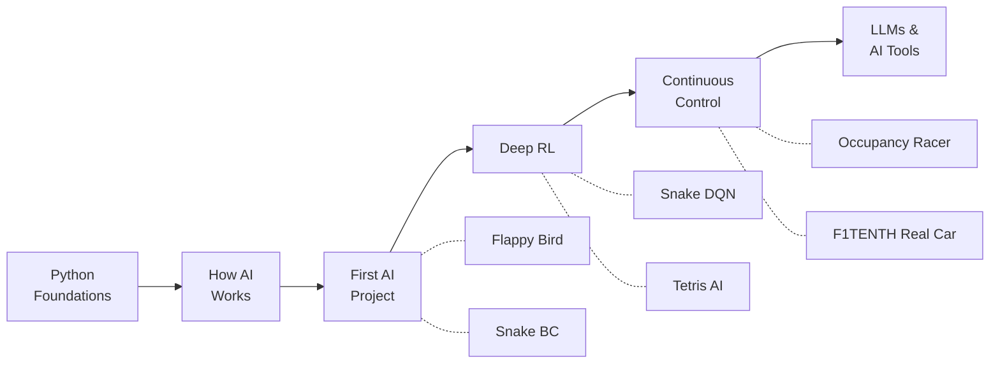
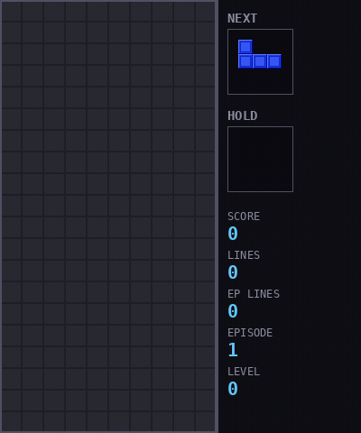

# AI Roadmap — From Zero to Autonomous Racing

I taught myself AI. Built 6 projects — from Snake to an autonomous race car that drives on real hardware. This is the path I'd recommend if I started over.



---

## Stage 0: Python Foundations

**Time:** 1-2 weeks

You don't need a CS degree. You need to be comfortable with Python — loops, functions, classes, and a few libraries. That's it.

**What to learn:**
- Python basics + OOP (classes, inheritance)
- NumPy (array math — you'll use it everywhere)
- Matplotlib (plotting training curves, debugging visually)

**Resources:**
- [Kaggle Learn Python](https://www.kaggle.com/learn/python) — free, interactive, no setup required
- [CS50P by Harvard](https://cs50.harvard.edu/python/) — more rigorous if you want stronger fundamentals

**Skip if:** You can write a class, use list comprehensions, and plot a sine wave with matplotlib without Googling the basics.

---

## Stage 1: How AI Actually Works

**Time:** 2 weeks

Don't touch code yet. Build intuition first. Understand what a neural network does before you build one — it'll save you weeks of confusion later.

**Resources:**
- [3Blue1Brown — Neural Networks](https://www.youtube.com/playlist?list=PLZHQObOWTQDNU6R1_67000Dx_ZCJB-3pi) — the best visual explanation of how neural nets learn. Watch all 4 videos.
- [StatQuest](https://www.youtube.com/@statquest) — strips ML concepts down to the basics. Great for "I read the paper and understood nothing."
- [Andrej Karpathy](https://www.youtube.com/@AndrejKarpathy) — his "Deep Dive into LLMs" talk gives you the big picture of where the field is heading

**Concepts you must understand before moving on:**
- What a model is (a function with learnable parameters)
- Training = adjusting parameters to minimize a loss function
- Gradient descent = how those adjustments happen
- Overfitting = memorizing instead of learning

---

## Stage 2: Your First AI Project

**Time:** 4 weeks

Two courses, two approaches. Do both — they complement each other.

**Resources:**
- [fast.ai](https://course.fast.ai/) — top-down: run working code first, understand theory later. Gets you building fast.
- [Karpathy — Neural Networks: Zero to Hero](https://github.com/karpathy/nn-zero-to-hero) (first 3 lectures) — bottom-up: build a neural net from scratch in pure Python. Painful but unforgettable.

Then build something. Don't follow a tutorial — pick a game, a dataset, a problem, and make it work.

---

### 🏆 CHECKPOINT: Flappy Bird AI

**Dueling Double DQN with NoisyNet exploration**

[](https://github.com/Beba-ai-ml/flappy-bird-ai)


Your first RL project should be simple enough to debug but complex enough to learn real concepts. Flappy Bird hits that sweet spot.

- **What it teaches:** DQN fundamentals, reward shaping, exploration vs exploitation
- **Architecture:** MLP variant (51K params) learns in 5-20K episodes. CNN variant (2.2M params) learns directly from pixels.
- **Key lesson:** Reward shaping matters more than model size. A well-shaped reward with a tiny network beats a massive network with a naive reward.

---

### 🏆 CHECKPOINT: Snake — Behavioral Cloning

**Learn to imitate before you learn to explore**

[](https://github.com/Beba-ai-ml/snake-behavioral-cloning)


Before you go deep into RL, understand supervised learning from demonstrations. Record a human playing, train a model to copy them. Simple, fast, and teaches you the data pipeline.

- **What it teaches:** Supervised learning, data collection, train/val splits, when imitation fails
- **Key lesson:** BC is fast to set up but has a hard ceiling — the model can't surpass the demonstrator. That's why you need RL.

---

## Stage 3: Deep Reinforcement Learning

**Time:** 6 weeks

Now you go deeper. Move beyond vanilla DQN — learn the tricks that make RL actually work.

**Resources:**
- [OpenAI Spinning Up](https://spinningup.openai.com/) — the best written intro to RL algorithms. Read the theory, study the code.
- [Hugging Face Deep RL Course](https://huggingface.co/learn/deep-rl-course/) — hands-on, with environments to train in directly

---

### 🏆 CHECKPOINT: Snake DQN Multi-Env

**Double DQN on a grid world, trained across multiple environments**

[](https://github.com/Beba-ai-ml/snake-dqn-multi-env)


Same game, fundamentally different approach. Now the agent learns on its own through trial and error — and generalizes across different grid sizes.

- **What it teaches:** Experience replay buffers, target networks, multi-environment training for generalization
- **Key lesson:** Training on one environment makes a brittle agent. Training on many makes a robust one.

---

### 🏆 CHECKPOINT: Tetris AI

**Afterstate V-Learning — 1,766 lines cleared in a single game**

[](https://github.com/Beba-ai-ml/tetris-ai)



This is where you learn that standard DQN doesn't always cut it. Tetris has a massive action space, and naive approaches plateau fast. The afterstate trick — evaluating board states after piece placement instead of action-value pairs — gave a **17.7x improvement** over standard DQN.

- **What it teaches:** Going beyond textbook algorithms, custom architectures, reward engineering
- **Stats:** Best game cleared 1,766 lines. Afterstate approach vs standard DQN isn't even close.
- **Key lesson:** The biggest gains in AI come from thinking about the problem differently, not from bigger models.

---

## Stage 4: Continuous Control & Sim-to-Real

**Time:** 8+ weeks

Everything before this used discrete actions — left, right, jump. Now you work with continuous values: steering angles, throttle percentages. This is a different beast.

**Resources:**
- [SAC Paper](https://arxiv.org/abs/1801.01290) (Haarnoja et al.) — read it. SAC is the workhorse algorithm for continuous control.
- [Dive into Deep Learning](https://d2l.ai/) — free textbook, excellent for filling gaps in your understanding

---

### 🏆 CHECKPOINT: Occupancy Racer SAC

**Autonomous racing with 450-ray LiDAR, trained on 40 procedural maps**

[](https://github.com/Beba-ai-ml/occupancy-racer-sac2)


This is the project where everything came together. A 6.65M parameter SAC agent, 32 CPU actors feeding experience to a GPU learner, trained across 40 randomized maps.

- **What it teaches:** SAC algorithm, continuous action spaces, async multi-process training, domain randomization
- **Architecture:** 32 parallel CPU actors + 1 GPU learner, 450-ray LiDAR input, ~300K steps to converge
- **Key lesson:** Scaling training across multiple processes and environments is what separates toy projects from real ones.


---

### 🏆 CHECKPOINT: ROS2 F1TENTH

**Deployed on real hardware — Jetson Nano, real LiDAR, real car**

[](https://github.com/Beba-ai-ml/ros2_ws2)

The moment your model drives a real car is when everything clicks. Sim-to-real transfer is its own discipline — sensor noise, latency, mechanical imperfections. Everything your simulation ignored comes back to bite you.

- **What it teaches:** Sim-to-real transfer, ROS2 integration, real-time inference on edge hardware
- **Key lesson:** A model that works perfectly in simulation will fail on real hardware. Domain randomization during training is what bridges the gap.

---

## Stage 5: LLMs & AI Tools

This is a different branch of AI, not a continuation of RL. Mentioning it because it's where most practical value is right now.

- Watch Karpathy's "Deep Dive into LLMs like ChatGPT" for the technical foundation
- Learn prompt engineering and API usage — these are practical skills with immediate payoff
- Build something that uses an LLM API: a tool, a workflow, an assistant

AI isn't just about training models — it's about knowing when to use existing ones. Most real-world problems don't need a custom model. They need someone who understands AI well enough to pick the right tool.

No project checkpoint here. This stage is about applying AI, not building from scratch.

---

## Resources

| Resource | Type | Best For | Link |
|----------|------|----------|------|
| Kaggle Learn Python | Course | Python basics, interactive | [kaggle.com](https://www.kaggle.com/learn/python) |
| CS50P | Course | Rigorous Python foundations | [cs50.harvard.edu](https://cs50.harvard.edu/python/) |
| 3Blue1Brown Neural Nets | Video | Visual intuition for neural networks | [YouTube](https://www.youtube.com/playlist?list=PLZHQObOWTQDNU6R1_67000Dx_ZCJB-3pi) |
| StatQuest | Video | ML concepts explained simply | [YouTube](https://www.youtube.com/@statquest) |
| fast.ai | Course | Top-down, build-first approach | [course.fast.ai](https://course.fast.ai/) |
| Karpathy Zero to Hero | Course | Bottom-up, build from scratch | [GitHub](https://github.com/karpathy/nn-zero-to-hero) |
| OpenAI Spinning Up | Guide | RL theory and implementation | [spinningup.openai.com](https://spinningup.openai.com/) |
| HuggingFace Deep RL | Course | Hands-on RL with environments | [huggingface.co](https://huggingface.co/learn/deep-rl-course/) |
| SAC Paper | Paper | Continuous control algorithm | [arxiv.org](https://arxiv.org/abs/1801.01290) |
| Dive into Deep Learning | Book | Filling knowledge gaps, reference | [d2l.ai](https://d2l.ai/) |

---

## The Progression

```
Flappy Bird (beginner) → Snake BC (beginner) → Snake DQN (intermediate) →
Tetris (advanced) → Occupancy Racer (advanced) → Real Car (expert)
```

Each project taught me something the previous one couldn't. Flappy Bird taught me RL basics. Snake BC showed me supervised learning's ceiling. Snake DQN taught me generalization. Tetris forced me to think beyond standard algorithms. The Racer made me scale. The real car humbled me.

You don't need to follow this exact path. But you do need to build things — progressively harder things — and not just watch tutorials.

Start building.

---

**Author:** [Beba-ai-ml](https://github.com/Beba-ai-ml) | **Site:** [stronabeby.pl](https://stronabeby.pl)

[](LICENSE)
