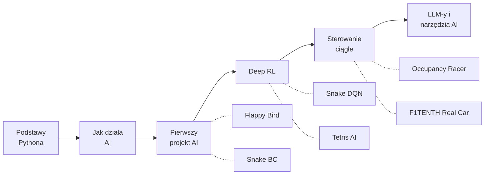

# AI Roadmap — Od Zera do Autonomicznych Wyścigów

Nauczyłem się AI sam. Zbudowałem 6 projektów — od Snake'a po autonomiczny samochód wyścigowy jeżdżący na prawdziwym sprzęcie. To ścieżka, którą bym polecił, gdybym zaczynał od nowa.

Ten roadmap jest dla osób, które chcą nauczyć się AI przez budowanie — od prostych gier po prawdziwy sprzęt. Nie potrzebujesz studiów ani doświadczenia. Potrzebujesz Pythona i determinacji. Ścieżka skupia się na reinforcement learning, ale ostatni etap obejmuje też LLM-y i narzędzia AI.

**Po ukończeniu tej ścieżki będziesz umiał:**
- Trenować agenty RL, które uczą się grać w gry od zera
- Budować systemy z ciągłym sterowaniem (kąt skrętu, gaz, hamulec)
- Wdrażać modele na prawdziwym sprzęcie (sim-to-real)
- Świadomie korzystać z narzędzi AI (LLM-y, API, prompty)

**Cały roadmap:** ~6 miesięcy (zakładając 2-3 godziny dziennie)

**Wymagania sprzętowe:**
- Etapy 0-3: laptop wystarczy (GPU przyspiesza, ale nie jest wymagane)
- Etap 4: GPU zalecane (trening 32 aktorów)
- F1TENTH: dedykowany sprzęt (Jetson Nano, LiDAR, platforma F1TENTH)

## Spis treści

- [Etap 0: Podstawy Pythona](#etap-0-podstawy-pythona)
- [Etap 1: Jak AI naprawdę działa](#etap-1-jak-ai-naprawdę-działa)
- [Etap 2: Twój pierwszy projekt AI](#etap-2-twój-pierwszy-projekt-ai) — Snake BC
- [Etap 3: Deep Reinforcement Learning](#etap-3-deep-reinforcement-learning) — Flappy Bird, Snake DQN, Tetris
- [Etap 4: Sterowanie ciągłe i sim-to-real](#etap-4-sterowanie-ciągłe-i-sim-to-real) — Occupancy Racer, F1TENTH
- [Bonus: LLM-y i narzędzia AI](#bonus-llm-y-i-narzędzia-ai)
- [Materiały](#materiały)
- [Progresja](#progresja)

---

## Etap 0: Podstawy Pythona

**Czas:** 1-2 tygodnie

Nie potrzebujesz dyplomu z informatyki. Musisz czuć się swobodnie z Pythonem — pętle, funkcje, klasy i kilka bibliotek. Tyle.

**Czego się nauczyć:**
- Podstawy Pythona + OOP (klasy, dziedziczenie)
- NumPy (operacje na tablicach — będziesz tego używać wszędzie)
- Matplotlib (wykresy krzywych treningowych, wizualny debugging)

**Materiały:**
- [Kaggle Learn Python](https://www.kaggle.com/learn/python) — darmowy, interaktywny, zero konfiguracji
- [CS50P by Harvard](https://cs50.harvard.edu/python/) — bardziej rygorystyczny, jeśli chcesz mocniejsze fundamenty

**Pomiń, jeśli:** Potrafisz napisać klasę, użyć list comprehension i narysować sinusoidę w matplotlib bez googlowania podstaw.

---

## Etap 1: Jak AI naprawdę działa

**Czas:** 2 tygodnie

Jeszcze nie dotykaj kodu. Najpierw zbuduj intuicję. Zrozum, co robi sieć neuronowa, zanim ją napiszesz — to oszczędzi ci tygodni frustracji.

**Materiały:**
- [3Blue1Brown — Neural Networks](https://www.youtube.com/playlist?list=PLZHQObOWTQDNU6R1_67000Dx_ZCJB-3pi) — najlepsza wizualna prezentacja tego, jak sieci neuronowe się uczą. Obejrzyj wszystkie 4 filmy.
- [StatQuest](https://www.youtube.com/@statquest) — rozbija pojęcia ML na czynniki pierwsze. Idealne, gdy przeczytałeś paper i nic nie zrozumiałeś.
- [Andrej Karpathy](https://www.youtube.com/@AndrejKarpathy) — jego "Deep Dive into LLMs" daje szeroki obraz tego, dokąd zmierza cała dziedzina

**Pojęcia, które musisz zrozumieć, zanim pójdziesz dalej:**
- Czym jest model (funkcja z uczącymi się parametrami)
- Trening = dopasowywanie parametrów, żeby zminimalizować funkcję straty (loss function)
- Spadek gradientowy (gradient descent) = mechanizm tych dopasowań
- Przeuczenie (overfitting) = zapamiętywanie zamiast uczenia się

---

## Etap 2: Twój pierwszy projekt AI

**Czas:** 4 tygodnie

Dwa kursy, dwa podejścia. Zrób oba — wzajemnie się uzupełniają.

**Materiały:**
- [fast.ai](https://course.fast.ai/) — podejście top-down: najpierw działający kod, teoria potem. Szybko budujesz.
- [Karpathy — Neural Networks: Zero to Hero](https://github.com/karpathy/nn-zero-to-hero) (pierwsze 3 wykłady) — podejście bottom-up: budujesz sieć neuronową od zera w czystym Pythonie. Bolesne, ale niezapomniane.

Potem zbuduj coś. Nie podążaj za tutorialem — wybierz grę, dataset, problem i spraw, żeby to działało.

---

### 🏆 CHECKPOINT: Snake — Behavioral Cloning

**Naucz się naśladować, zanim nauczysz się eksplorować**

Zanim wejdziesz głęboko w RL, zrozum uczenie nadzorowane (supervised learning) z demonstracji. Nagraj człowieka grającego, wytrenuj model, żeby go kopiował. Proste, szybkie i uczy pipeline'u danych.

- **Czego uczy:** Uczenie nadzorowane, zbieranie danych, podział train/val, kiedy imitacja zawodzi
- **Architektura:** Mały MLP trenowany na nagraniach ludzkich rozgrywek. Szybki do wytrenowania — minuty, nie godziny.
- **Kluczowa lekcja:** BC jest szybkie w konfiguracji, ale ma twardy pułap — model nie przeskoczy poziomu demonstratora. Dlatego potrzebujesz RL.

---

## Etap 3: Deep Reinforcement Learning

**Czas:** 6 tygodni

Teraz idziesz głębiej. Wyjdź poza podstawowe DQN — poznaj triki, które sprawiają, że RL naprawdę działa.

**Materiały:**
- [OpenAI Spinning Up](https://spinningup.openai.com/) — najlepiej napisane wprowadzenie do algorytmów RL. Czytaj teorię, analizuj kod.
- [Hugging Face Deep RL Course](https://huggingface.co/learn/deep-rl-course/) — praktyczny, z gotowymi środowiskami do trenowania

---

### 🏆 CHECKPOINT: Flappy Bird AI

**Dueling Double DQN z eksploracją NoisyNet**

Twój pierwszy projekt RL powinien być wystarczająco prosty do debugowania, ale wystarczająco złożony, żeby nauczyć prawdziwych pojęć. Flappy Bird jest tu idealnym wyborem.

- **Czego uczy:** Podstawy DQN, kształtowanie nagrody (reward shaping), eksploracja vs eksploatacja
- **Architektura:** Wariant MLP (51K parametrów) uczy się w 5-20K epizodów. Wariant CNN (2.2M parametrów) uczy się bezpośrednio z pikseli.
- **Kluczowa lekcja:** Kształtowanie nagrody ma większe znaczenie niż rozmiar modelu. Dobrze zaprojektowana nagroda z malutką siecią bije ogromną sieć z naiwną nagrodą.

---

### 🏆 CHECKPOINT: Snake DQN Multi-Env

**Double DQN na grid world, trenowany na wielu środowiskach**

Ta sama gra, zupełnie inne podejście. Teraz agent uczy się sam metodą prób i błędów — i generalizuje na różne rozmiary planszy. Agent trenowany na planszy 10x10 nie umie grać na 15x15. Agent trenowany na 5 różnych rozmiarach radzi sobie na wszystkich — nawet tych, których nigdy nie widział.

- **Czego uczy:** Bufor doświadczeń (experience replay), sieci docelowe (target networks), trening na wielu środowiskach dla generalizacji
- **Architektura:** Double DQN z wieloma równoległymi środowiskami o różnych rozmiarach planszy. Wspólna sieć uczy się uniwersalnej strategii.
- **Kluczowa lekcja:** Trening na jednym środowisku daje kruchego agenta. Trening na wielu daje solidnego.

---

### 🏆 CHECKPOINT: Tetris AI

**Afterstate V-Learning — 1766 linii wyczyszczonych w jednej grze**

Tu się uczysz, że standardowe DQN nie zawsze wystarczy. Tetris ma ogromną przestrzeń akcji, a naiwne podejścia szybko się nasycają. Trik z afterstate — ocenianie stanów planszy po postawieniu klocka zamiast par akcja-wartość — dał **17.7x poprawę** nad standardowym DQN.

- **Czego uczy:** Wychodzenie poza podręcznikowe algorytmy, niestandardowe architektury, inżynieria nagród
- **Architektura:** Afterstate V-network oceniający stan planszy po postawieniu klocka. Eliminuje ogromną przestrzeń akcji — sieć widzi tylko wyniki, nie ruchy.
- **Statystyki:** Najlepsza gra wyczyściła 1766 linii. Afterstate vs standardowe DQN — nie ma porównania.
- **Kluczowa lekcja:** Największe skoki w AI biorą się z innego myślenia o problemie, nie z większych modeli.

---

## Etap 4: Sterowanie ciągłe i sim-to-real

**Czas:** 8+ tygodni

Wszystko do tej pory używało dyskretnych akcji — lewo, prawo, skok. Teraz pracujesz z wartościami ciągłymi: kąty skrętu, procent gazu. To zupełnie inna liga.

**Materiały:**
- [SAC Paper](https://arxiv.org/abs/1801.01290) (Haarnoja et al.) — przeczytaj go. SAC to główny algorytm sterowania ciągłego.
- [Dive into Deep Learning](https://d2l.ai/) — darmowy podręcznik, świetny do uzupełniania luk w wiedzy

---

### 🏆 CHECKPOINT: Occupancy Racer SAC

**Autonomiczne wyścigi z 450-promieniowym LiDAR-em, trenowane na 40 proceduralnych mapach**

To jest projekt, w którym wszystko się połączyło. Agent SAC z 6.65M parametrów, 32 aktorów CPU karmiących doświadczeniem GPU learner, trenowany na 40 losowych mapach.

- **Czego uczy:** Algorytm SAC, ciągła przestrzeń akcji, asynchroniczny trening wieloprocesowy, domain randomization
- **Architektura:** 32 równoległe aktory CPU + 1 GPU learner, wejście 450-promieniowy LiDAR, ~300K kroków do zbieżności
- **Kluczowa lekcja:** Skalowanie treningu na wiele procesów i środowisk to różnica między projektami-zabawkami a prawdziwymi.

---

### 🏆 CHECKPOINT: ROS2 F1TENTH

**Wdrożony na prawdziwym sprzęcie — Jetson Nano, prawdziwy LiDAR, prawdziwy samochód**

<!-- TODO: Dodaj zdjęcie/GIF prawdziwego samochodu F1TENTH na torze (assets/f1tenth.jpg) -->

Moment, w którym twój model prowadzi prawdziwy samochód — wtedy wszystko nabiera sensu. Sim-to-real transfer to osobna dyscyplina — szum sensorów, opóźnienia, mechaniczne niedoskonałości. Wszystko, co twoja symulacja zignorowała, wraca ze zdwojoną siłą.

- **Czego uczy:** Sim-to-real transfer, integracja z ROS2, wnioskowanie w czasie rzeczywistym na sprzęcie brzegowym
- **Architektura:** Model SAC z symulatora wdrożony na Jetson Nano. LiDAR jako wejście, sterowanie VESC jako wyjście. Inference w pętli ROS2 z częstotliwością ~40 Hz.
- **Kluczowa lekcja:** Model, który idealnie działa w symulacji, zawiedzie na prawdziwym sprzęcie. Domain randomization podczas treningu jest tym, co łączy te dwa światy.

---

## Bonus: LLM-y i narzędzia AI

To inna gałąź AI, nie kontynuacja RL. Wspominam o tym, bo tu jest teraz największa praktyczna wartość.

- Obejrzyj Karpathy'ego "Deep Dive into LLMs like ChatGPT" dla technicznego fundamentu
- Naucz się prompt engineeringu i korzystania z API — to praktyczne umiejętności z natychmiastowym zwrotem
- Zbuduj coś, co używa LLM API: narzędzie, workflow, asystenta

AI to nie tylko trenowanie modeli — to wiedza o tym, kiedy użyć istniejących. Większość realnych problemów nie potrzebuje custom modelu. Potrzebuje kogoś, kto rozumie AI wystarczająco dobrze, żeby wybrać odpowiednie narzędzie.

---

## Materiały

| Zasób | Typ | Poziom | Link |
|-------|-----|--------|------|
| Kaggle Learn Python | Kurs | Początkujący | [kaggle.com](https://www.kaggle.com/learn/python) |
| CS50P | Kurs | Początkujący | [cs50.harvard.edu](https://cs50.harvard.edu/python/) |
| 3Blue1Brown Neural Nets | Wideo | Początkujący | [YouTube](https://www.youtube.com/playlist?list=PLZHQObOWTQDNU6R1_67000Dx_ZCJB-3pi) |
| StatQuest | Wideo | Początkujący | [YouTube](https://www.youtube.com/@statquest) |
| fast.ai | Kurs | Średniozaawansowany | [course.fast.ai](https://course.fast.ai/) |
| Karpathy Zero to Hero | Kurs | Średniozaawansowany | [GitHub](https://github.com/karpathy/nn-zero-to-hero) |
| OpenAI Spinning Up | Poradnik | Zaawansowany | [spinningup.openai.com](https://spinningup.openai.com/) |
| HuggingFace Deep RL | Kurs | Zaawansowany | [huggingface.co](https://huggingface.co/learn/deep-rl-course/) |
| SAC Paper | Paper | Zaawansowany | [arxiv.org](https://arxiv.org/abs/1801.01290) |
| Dive into Deep Learning | Książka | Wszystkie | [d2l.ai](https://d2l.ai/) |

---

## Progresja

| Projekt | Poziom | Kluczowa umiejętność |
|---------|--------|---------------------|
| Snake BC | Początkujący | Uczenie nadzorowane |
| Flappy Bird | Początkujący | Podstawy DQN |
| Snake DQN | Średniozaawansowany | Generalizacja |
| Tetris AI | Zaawansowany | Niestandardowe algorytmy |
| Occupancy Racer | Zaawansowany | Skalowanie treningu |
| F1TENTH | Ekspert | Sim-to-real transfer |

Każdy projekt nauczył mnie czegoś, czego poprzedni nie mógł. Flappy Bird nauczył mnie podstaw RL. Snake BC pokazał pułap supervised learningu. Snake DQN nauczył generalizacji. Tetris zmusił mnie do myślenia poza standardowymi algorytmami. Racer nauczył skalowania. Prawdziwy samochód mnie upokorzył.

Nie musisz iść dokładnie tą ścieżką. Ale musisz budować — coraz trudniejsze rzeczy — a nie tylko oglądać tutoriale.

Zacznij budować. [Etap 0 czeka na ciebie.](#etap-0-podstawy-pythona)

---

**Autor:** [Beba-ai-ml](https://github.com/Beba-ai-ml) | **Strona:** [stronabeby.pl](https://stronabeby.pl)

