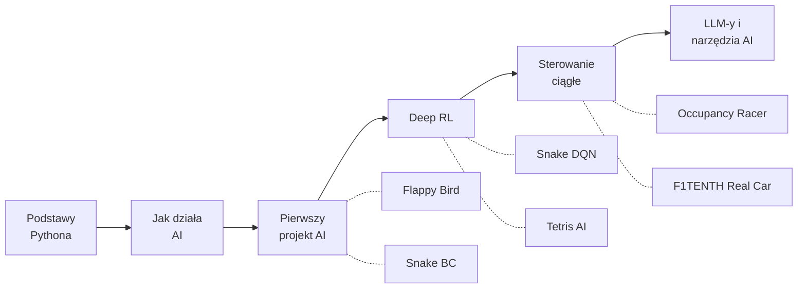

# AI Roadmap — Od Zera do Autonomicznych Wyścigów

Nauczyłem się AI sam. Zbudowałem 6 projektów — od Snake'a po autonomiczny samochód wyścigowy jeżdżący na prawdziwym sprzęcie. To ścieżka, którą bym polecił, gdybym zaczynał od nowa.



---

## Etap 0: Podstawy Pythona

**Czas:** 1-2 tygodnie

Nie potrzebujesz dyplomu z informatyki. Musisz czuć się swobodnie z Pythonem — pętle, funkcje, klasy i kilka bibliotek. Tyle.

**Czego się nauczyć:**
- Podstawy Pythona + OOP (klasy, dziedziczenie)
- NumPy (operacje na tablicach — będziesz tego używać wszędzie)
- Matplotlib (wykresy krzywych treningowych, wizualny debugging)

**Materiały:**
- [Kaggle Learn Python](https://www.kaggle.com/learn/python) — darmowy, interaktywny, zero konfiguracji
- [CS50P by Harvard](https://cs50.harvard.edu/python/) — bardziej rygorystyczny, jeśli chcesz mocniejsze fundamenty

**Pomiń, jeśli:** Potrafisz napisać klasę, użyć list comprehension i narysować sinusoidę w matplotlib bez googlowania podstaw.

---

## Etap 1: Jak AI Naprawdę Działa

**Czas:** 2 tygodnie

Jeszcze nie dotykaj kodu. Najpierw zbuduj intuicję. Zrozum, co robi sieć neuronowa, zanim ją napiszesz — to oszczędzi ci tygodni frustracji.

**Materiały:**
- [3Blue1Brown — Neural Networks](https://www.youtube.com/playlist?list=PLZHQObOWTQDNU6R1_67000Dx_ZCJB-3pi) — najlepsza wizualna prezentacja tego, jak sieci neuronowe się uczą. Obejrzyj wszystkie 4 filmy.
- [StatQuest](https://www.youtube.com/@statquest) — rozbija koncepty ML na czynniki pierwsze. Idealne, gdy przeczytałeś paper i nic nie zrozumiałeś.
- [Andrej Karpathy](https://www.youtube.com/@AndrejKarpathy) — jego "Deep Dive into LLMs" daje szeroki obraz tego, dokąd zmierza cała dziedzina

**Koncepty, które musisz zrozumieć, zanim pójdziesz dalej:**
- Czym jest model (funkcja z uczącymi się parametrami)
- Trening = dopasowywanie parametrów, żeby zminimalizować loss function
- Gradient descent = mechanizm tych dopasowań
- Overfitting = zapamiętywanie zamiast uczenia się

---

## Etap 2: Twój Pierwszy Projekt AI

**Czas:** 4 tygodnie

Dwa kursy, dwa podejścia. Zrób oba — wzajemnie się uzupełniają.

**Materiały:**
- [fast.ai](https://course.fast.ai/) — podejście top-down: najpierw działający kod, teoria potem. Szybko budujesz.
- [Karpathy — Neural Networks: Zero to Hero](https://github.com/karpathy/nn-zero-to-hero) (pierwsze 3 wykłady) — podejście bottom-up: budujesz sieć neuronową od zera w czystym Pythonie. Bolesne, ale niezapomniane.

Potem zbuduj coś. Nie podążaj za tutorialem — wybierz grę, dataset, problem i spraw, żeby to działało.

---

### 🏆 CHECKPOINT: Flappy Bird AI

**Dueling Double DQN z eksploracją NoisyNet**

[](https://github.com/Beba-ai-ml/flappy-bird-ai)


Twój pierwszy projekt RL powinien być wystarczająco prosty do debugowania, ale wystarczająco złożony, żeby nauczyć prawdziwych konceptów. Flappy Bird trafia w ten punkt.

- **Czego uczy:** Podstawy DQN, reward shaping, exploration vs exploitation
- **Architektura:** Wariant MLP (51K parametrów) uczy się w 5-20K epizodów. Wariant CNN (2.2M parametrów) uczy się bezpośrednio z pikseli.
- **Kluczowa lekcja:** Reward shaping ma większe znaczenie niż rozmiar modelu. Dobrze zaprojektowana nagroda z malutką siecią bije ogromną sieć z naiwną nagrodą.

---

### 🏆 CHECKPOINT: Snake — Behavioral Cloning

**Naucz się naśladować, zanim nauczysz się eksplorować**

[](https://github.com/Beba-ai-ml/snake-behavioral-cloning)


Zanim wejdziesz głęboko w RL, zrozum supervised learning z demonstracji. Nagraj człowieka grającego, wytrenuj model, żeby go kopiował. Proste, szybkie i uczy pipeline'u danych.

- **Czego uczy:** Supervised learning, zbieranie danych, podział train/val, kiedy imitacja zawodzi
- **Kluczowa lekcja:** BC jest szybkie w konfiguracji, ale ma twardy sufit — model nie przeskoczy poziomu demonstratora. Dlatego potrzebujesz RL.

---

## Etap 3: Deep Reinforcement Learning

**Czas:** 6 tygodni

Teraz idziesz głębiej. Wyjdź poza podstawowe DQN — poznaj triki, które sprawiają, że RL naprawdę działa.

**Materiały:**
- [OpenAI Spinning Up](https://spinningup.openai.com/) — najlepiej napisane wprowadzenie do algorytmów RL. Czytaj teorię, analizuj kod.
- [Hugging Face Deep RL Course](https://huggingface.co/learn/deep-rl-course/) — praktyczny, z gotowymi środowiskami do trenowania

---

### 🏆 CHECKPOINT: Snake DQN Multi-Env

**Double DQN na grid world, trenowany na wielu środowiskach**

[](https://github.com/Beba-ai-ml/snake-dqn-multi-env)


Ta sama gra, zupełnie inne podejście. Teraz agent uczy się sam metodą prób i błędów — i generalizuje na różne rozmiary planszy.

- **Czego uczy:** Experience replay buffer, target networks, trening na wielu środowiskach dla generalizacji
- **Kluczowa lekcja:** Trening na jednym środowisku daje kruchego agenta. Trening na wielu daje solidnego.

---

### 🏆 CHECKPOINT: Tetris AI

**Afterstate V-Learning — 1766 linii wyczyszczonych w jednej grze**

[](https://github.com/Beba-ai-ml/tetris-ai)


Tu się uczysz, że standardowe DQN nie zawsze wystarczy. Tetris ma ogromną przestrzeń akcji, a naiwne podejścia szybko się nasycają. Trik z afterstate — ocenianie stanów planszy po postawieniu klocka zamiast par akcja-wartość — dał **17.7x poprawę** nad standardowym DQN.

- **Czego uczy:** Wychodzenie poza podręcznikowe algorytmy, niestandardowe architektury, inżynieria nagród
- **Statystyki:** Najlepsza gra wyczyściła 1766 linii. Afterstate vs standardowe DQN — nie ma porównania.
- **Kluczowa lekcja:** Największe skoki w AI biorą się z innego myślenia o problemie, nie z większych modeli.

---

## Etap 4: Sterowanie Ciągłe i Sim-to-Real

**Czas:** 8+ tygodni

Wszystko do tej pory używało dyskretnych akcji — lewo, prawo, skok. Teraz pracujesz z wartościami ciągłymi: kąty skrętu, procent gazu. To zupełnie inna liga.

**Materiały:**
- [SAC Paper](https://arxiv.org/abs/1801.01290) (Haarnoja et al.) — przeczytaj go. SAC to koń roboczy sterowania ciągłego.
- [Dive into Deep Learning](https://d2l.ai/) — darmowy podręcznik, świetny do uzupełniania luk w wiedzy

---

### 🏆 CHECKPOINT: Occupancy Racer SAC

**Autonomiczne wyścigi z 450-promieniowym LiDAR-em, trenowane na 40 proceduralnych mapach**

[](https://github.com/Beba-ai-ml/occupancy-racer-sac2)


To jest projekt, w którym wszystko się połączyło. Agent SAC z 6.65M parametrów, 32 aktorów CPU karmiących doświadczeniem GPU learner, trenowany na 40 losowych mapach.

- **Czego uczy:** Algorytm SAC, ciągła przestrzeń akcji, asynchroniczny trening wieloprocesowy, domain randomization
- **Architektura:** 32 równoległe aktory CPU + 1 GPU learner, wejście 450-promieniowy LiDAR, ~300K kroków do zbieżności
- **Kluczowa lekcja:** Skalowanie treningu na wiele procesów i środowisk to różnica między projektami-zabawkami a prawdziwymi.


---

### 🏆 CHECKPOINT: ROS2 F1TENTH

**Wdrożony na prawdziwym sprzęcie — Jetson Nano, prawdziwy LiDAR, prawdziwy samochód**

[](https://github.com/Beba-ai-ml/ros2_ws2)

Moment, w którym twój model prowadzi prawdziwy samochód — wtedy wszystko klika. Sim-to-real transfer to osobna dyscyplina — szum sensorów, opóźnienia, mechaniczne niedoskonałości. Wszystko, co twoja symulacja zignorowała, wraca ze zdwojoną siłą.

- **Czego uczy:** Sim-to-real transfer, integracja z ROS2, wnioskowanie w czasie rzeczywistym na sprzęcie brzegowym
- **Kluczowa lekcja:** Model, który idealnie działa w symulacji, zawiedzie na prawdziwym sprzęcie. Domain randomization podczas treningu jest tym, co łączy te dwa światy.

---

## Etap 5: LLM-y i Narzędzia AI

To inna gałąź AI, nie kontynuacja RL. Wspominam o tym, bo tu jest teraz największa praktyczna wartość.

- Obejrzyj Karpathy'ego "Deep Dive into LLMs like ChatGPT" dla technicznego fundamentu
- Naucz się prompt engineeringu i korzystania z API — to praktyczne umiejętności z natychmiastowym zwrotem
- Zbuduj coś, co używa LLM API: narzędzie, workflow, asystenta

AI to nie tylko trenowanie modeli — to wiedza, kiedy użyć istniejących. Większość realnych problemów nie potrzebuje custom modelu. Potrzebuje kogoś, kto rozumie AI wystarczająco dobrze, żeby wybrać odpowiednie narzędzie.

Brak checkpointu projektowego. Ten etap to stosowanie AI, nie budowanie od zera.

---

## Materiały

| Zasób | Typ | Najlepsze do | Link |
|-------|-----|--------------|------|
| Kaggle Learn Python | Kurs | Podstawy Pythona, interaktywny | [kaggle.com](https://www.kaggle.com/learn/python) |
| CS50P | Kurs | Solidne fundamenty Pythona | [cs50.harvard.edu](https://cs50.harvard.edu/python/) |
| 3Blue1Brown Neural Nets | Wideo | Wizualna intuicja sieci neuronowych | [YouTube](https://www.youtube.com/playlist?list=PLZHQObOWTQDNU6R1_67000Dx_ZCJB-3pi) |
| StatQuest | Wideo | Koncepty ML wyjaśnione prosto | [YouTube](https://www.youtube.com/@statquest) |
| fast.ai | Kurs | Top-down, najpierw buduj | [course.fast.ai](https://course.fast.ai/) |
| Karpathy Zero to Hero | Kurs | Bottom-up, buduj od zera | [GitHub](https://github.com/karpathy/nn-zero-to-hero) |
| OpenAI Spinning Up | Poradnik | Teoria i implementacja RL | [spinningup.openai.com](https://spinningup.openai.com/) |
| HuggingFace Deep RL | Kurs | Praktyczne RL ze środowiskami | [huggingface.co](https://huggingface.co/learn/deep-rl-course/) |
| SAC Paper | Paper | Algorytm sterowania ciągłego | [arxiv.org](https://arxiv.org/abs/1801.01290) |
| Dive into Deep Learning | Książka | Uzupełnianie luk, referencja | [d2l.ai](https://d2l.ai/) |

---

## Progresja

```
Flappy Bird (początkujący) → Snake BC (początkujący) → Snake DQN (średniozaawansowany) →
Tetris (zaawansowany) → Occupancy Racer (zaawansowany) → Prawdziwy Samochód (ekspert)
```

Każdy projekt nauczył mnie czegoś, czego poprzedni nie mógł. Flappy Bird nauczył mnie podstaw RL. Snake BC pokazał sufit supervised learningu. Snake DQN nauczył generalizacji. Tetris zmusił mnie do myślenia poza standardowymi algorytmami. Racer nauczył skalowania. Prawdziwy samochód mnie upokorzyło.

Nie musisz iść dokładnie tą ścieżką. Ale musisz budować — coraz trudniejsze rzeczy — a nie tylko oglądać tutoriale.

Zacznij budować.

---

**Autor:** [Beba-ai-ml](https://github.com/Beba-ai-ml) | **Strona:** [stronabeby.pl](https://stronabeby.pl)

[](LICENSE)
